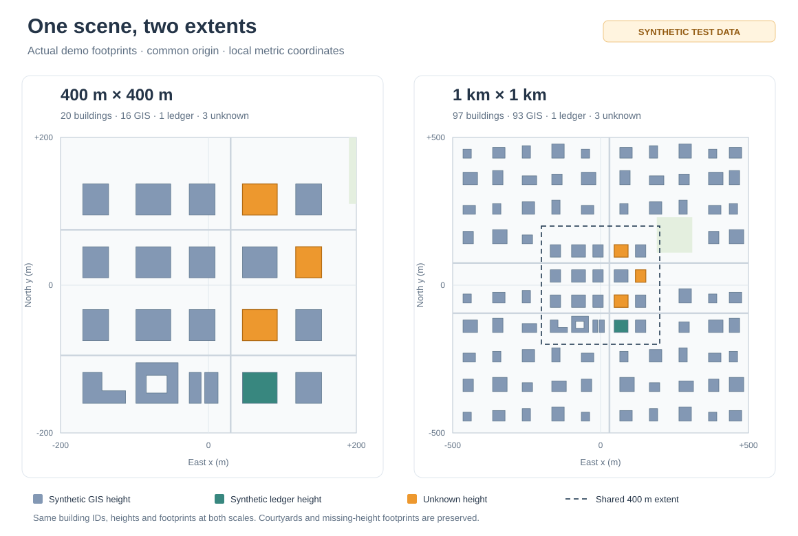

# Gangnam Urban Block Lab

[](https://github.com/ytw1227/gangnam-urban-block-lab/actions/workflows/tests.yml)

**강남역 400 m × 400 m / 1 km × 1 km 도시 블록 모델링 테스트**

건물 폴리곤과 높이를 평면 지면 위의 3D 블록으로 변환하는 Python 프로젝트입니다. 같은 중심점에서 두 공간 범위를 비교하고, 외곽선·높이 출처·누락 상태를 검토한 뒤 다른 시뮬레이터로 옮길 수 있도록 형상과 품질 기록을 함께 내보냅니다.

> **현재 상태: 합성 데이터 기반 모델링 프로토타입.** 기본 예제의 위치·외곽선·높이는 검증용으로 만든 값이며 실제 강남역 건물을 재현하지 않습니다. 공식 GIS 파일 입력 경로는 구현되어 있으나 실지역 데이터 통합 검증은 아직 수행하지 않았습니다. 전파 계산은 포함하지 않습니다.



*고정 합성 장면을 위에서 본 비교입니다. 실제 강남역 지도나 관측 데이터가 아닙니다.*

## 두 크기, 하나의 장면

| 항목 | 400 m × 400 m | 1 km × 1 km |
|---|---|---|
| 로컬 범위 | 중심에서 x/y ±200 m | 중심에서 x/y ±500 m |
| 합성 건물 수 | 20개 | 97개 |
| 높이 확보 / 미확인 | 17개 / 3개 | 94개 / 3개 |
| 비교 범위 | 중앙 블록의 형상·누락 처리 | 외곽 구역과 네 모서리까지 확장한 장면 |

두 지도는 **같은 고정 합성 장면을 각각 잘라서** 만듭니다. 공통 범위의 건물 식별자·높이·외곽선은 동일하며, 1 km 화면은 중앙 건물을 확대하거나 빈 땅만 넓힌 결과가 아닙니다. 위 건물 수는 기본 합성 예제의 수치로, 실제 강남역의 건물 수가 아닙니다. 영역 크기는 정사각형의 가로·세로 길이입니다.

## 주요 기능

| 기능 | 구현 내용 |
|---|---|
| 외곽선 기반 입체화 | 오목한 외곽선·내부 중정·다중 폴리곤을 유지한 수직 블록과 닫힌 삼각형 메시 |
| 높이 출처 관리 | GIS 높이 우선, 확인된 동일 건물의 대장 표제부로만 보완 |
| 누락 보존 | 미확인 높이는 `null`로 유지하고 주황색 외곽선과 품질 기록으로 표시 |
| 일관된 좌표 | EPSG:5179(m)로 통일 후 중심 원점의 로컬 좌표로 변환, 지면 z = 0 |
| 배경 데이터 | 선택적으로 OSMnx의 도로·공원·토지이용·수면 수집 |
| 오프라인 미리보기 | 자체 포함 HTML, 회전·확대·입체/위에서 보기, 동일 축척 |
| 모델 내보내기 | GeoPackage, 로컬 장면 JSON, OBJ, 품질 CSV, 메타데이터 JSON |

화면에는 건물 이름을 표시하지 않습니다. 건물에 마우스를 올리면 식별자·높이·높이 출처를 확인할 수 있습니다. 원본 이름 속성은 저장 데이터에만 보존합니다.

## 빠른 시작

Python 3.11 이상을 권장하며 Python 3.13에서 검증했습니다. 아래 명령은 Windows PowerShell 기준입니다.

```powershell
git clone https://github.com/ytw1227/gangnam-urban-block-lab.git
cd gangnam-urban-block-lab
python -m venv .venv
.\.venv\Scripts\python.exe -m pip install -r requirements.txt
.\.venv\Scripts\python.exe -m region_model demo --out outputs\my_demo
```

생성된 `outputs/my_demo/400m/preview.html`과 `outputs/my_demo/1000m/preview.html`을 브라우저에서 엽니다. 인터넷 없이 회전·확대·위에서 보기가 가능합니다. 한 크기만 필요하면 명령에 `--size 400` 또는 `--size 1000`을 추가합니다. 출력 폴더가 이미 차 있으면 덮어쓰지 않고 중단하므로 `--out`에 새 경로를 지정하세요.

### VS Code에서 실행

의존성을 설치한 뒤 프로젝트 폴더를 열고 Python 디버깅 환경을 준비합니다. **F5**에서 `강남역 400m + 1km (합성 모델링 예제)`를 선택하면 두 지도를 생성하고 브라우저에 엽니다. `run_preview.py`는 실행마다 `outputs/gangnam_vscode_날짜시간/`에 결과를 저장하며 로그는 디버그 콘솔에 표시합니다.

직접 실행하려면 다음 명령을 사용합니다.

```powershell
.\.venv\Scripts\python.exe run_preview.py
```

### 지역과 중심점

활성 지역은 강남역 한 곳입니다. `config/regions.json`의 기본 중심은 강남역 사거리 부근 **경도 127.0276, 위도 37.4979**이며, 대표성이 검증되지 않은 임시 후보입니다. 실제 자료를 확인한 뒤 중심을 조정할 수 있습니다.

```powershell
.\.venv\Scripts\python.exe -m region_model demo --center 127.0276 37.4979 --out outputs\custom_demo
```

여의도·홍대입구·판교·분당의 미확정 후보는 `config/regions.pending.json`에 비활성 상태로 보존합니다. 현재 CLI 실행 대상과 생성 결과에는 포함하지 않습니다.

## 실제 GIS 데이터 연결

GIS건물통합정보 계열의 공식 SHP/GeoPackage/GeoJSON을 사용합니다. SHP는 `.shp`, `.shx`, `.dbf`, `.prj` 등 제공 파일을 같은 폴더에 보관합니다. 전국 파일보다 서울·경기 또는 관심 지역으로 나뉜 파일이 편리합니다.

공식 데이터 취득 경로:

- [국토교통부 GIS건물통합정보 파일 자료](https://www.data.go.kr/data/15083092/fileData.do): 건물 공간정보와 대장 속성을 건물 단위로 통합한 SHP 자료. 카탈로그에서 연결하는 [브이월드 자료 페이지](https://www.vworld.kr/dtmk/dtmk_ntads_s002.do?svcCde=NA&dsId=18)에서 서울·경기 해당 자료와 명세를 확인합니다.
- [GIS건물통합정보 WMS/WFS](https://www.data.go.kr/data/15123970/openapi.do): API를 선택할 때 확인할 공식 안내. 모델 형상에는 렌더링 이미지인 WMS 대신 벡터 자료가 필요합니다. 현재 시제품은 파일 입력으로 구현했습니다.
- [건축HUB 건축물대장정보](https://www.data.go.kr/data/15134735/openapi.do): 높이 보완용 표제부 취득 경로. API 활용신청·인증키가 필요하며, 공식 안내에 PK 변경 및 전환 규칙이 명시되어 있습니다. 구·신 PK를 그대로 혼용하지 않습니다.

공식 GIS 원본은 저장소에 포함되어 있지 않습니다. 다운로드 접근 조건과 실제 파일의 높이·식별자 열은 자료를 취득한 뒤 확인해야 합니다. 카탈로그의 배포일과 개별 건물 속성의 조사일은 구분하여 기록합니다.

### 1. 입력 자료 확인

먼저 자료의 CRS와 열을 확인합니다.

```powershell
.\.venv\Scripts\python.exe -m region_model inspect data\raw\buildings.shp
```

### 2. 스키마 설정

`config/schema.example.json`을 `config/schema.local.json`으로 복사하여 다음을 실제 값으로 채웁니다.

- `source_name`, `source_url`, `snapshot_date`: 제공기관 자료명, 상세 페이지, 자료 기준일.
- `id_field`: **건물 단위** 식별자 열. 필지 번호나 주소는 건물 식별자가 아닙니다.
- `name_field`: 선택 속성. 건물 이름이 있는 원본 열 이름이며 없는 경우 JSON `null`을 유지합니다. 이름과 출처는 GeoPackage·로컬 장면 JSON·품질 CSV에만 보존하고 화면에는 표시하지 않습니다.
- `height_field`: 지면 기준 건물 높이(m) 열. 제공 명세를 확인하세요. 없는 경우 JSON `null`.
- `height_unit`: `m`, `height_semantics`: `above_ground`. 층수·해발고도는 높이로 지정하지 않습니다.
- `source_crs`: 파일에 CRS가 없을 때만 제공기관 메타데이터의 CRS를 지정합니다. 좌표를 보고 추측하지 않습니다.
- `layer`, `encoding`: 필요한 경우 GeoPackage 레이어명과 SHP 문자 인코딩을 지정합니다.

제품·배포 시점마다 속성 이름이 달라질 수 있어 A1/A16 같은 열 이름을 자동 추측하지 않습니다. `.prj`가 있는데 다른 CRS를 강제로 지정하는 경우도 거부합니다.

### 3. 두 크기의 모델 생성

```powershell
.\.venv\Scripts\python.exe -m region_model build --buildings data\raw\buildings.shp --schema config\schema.local.json --osm --out outputs\gangnam
```

강남역의 같은 중심점으로 `outputs/gangnam/400m`와 `outputs/gangnam/1000m`에 각각 모델과 품질 기록을 생성합니다.

`--osm`은 OSMnx로 도로·공원·토지이용·수면을 수집합니다. OSM 건물을 공식 폴리곤 대신 쓰지 않습니다. 수집 장애는 성공한 빈 배경으로 숨기지 않고 중단합니다. 먼저 건물만 확인하려면 `--osm`을 생략하세요. 도로는 중심선 표시이며, 공원·토지이용·수면은 배경 표시용입니다. 수목이나 배경 속성의 전파 재료 모델을 만들지는 않습니다.

중심 직접 지정 예시:

```powershell
.\.venv\Scripts\python.exe -m region_model build --center 127.0276 37.4979 --buildings data\raw\buildings.shp --schema config\schema.local.json --out outputs\gangnam_custom
```

## 높이 보완의 연결 규칙

1. 유효한 GIS 높이가 있으면 그대로 사용합니다.
2. 없으면 검증된 건물별 연결표와 건축물대장 표제부의 높이만 사용합니다.
3. 연결 실패·중복 식별자·유효하지 않은 높이는 `null`로 남깁니다. 층수×임의 층고로 추정하지 않습니다.

`examples/ledger.csv`와 `examples/verified_matches.csv`는 **형식 예시이며 실제 대장 데이터가 아닙니다**. 건축HUB 등에서 확보한 표제부를 전자로 정규화하고, 실제로 확인한 건물별 연결을 후자에 기록합니다. 현재 코드에는 대장 API 자동 호출이나 동일 건물 자동 판정 기능은 없습니다.

필수 CSV 열:

- 대장: `ledger_id,height_m,record_type,namespace`. `record_type=title`은 해당 건물의 표제부이며 총괄표제부가 아닙니다.
- 연결표: `building_id,ledger_id,namespace,verified,identity_method,identity_evidence`.
- `verified=true`, `identity_method=official_crosswalk` 또는 `manual_building_confirmation`, 비어 있지 않은 확인 근거가 모두 필요합니다.
- ID는 문자열로 취급합니다. 선행 0과 긴 번호를 보존하고 Excel의 숫자 자동변환에 주의하세요.
- `namespace`는 출처·식별자 체계·스냅샷을 구분하는 값입니다. 구·신 PK가 같은 숫자라는 이유로 연결되지 않도록 대장과 연결표에서 같아야 합니다.
- 동일 표제부를 여러 동에 복제하거나 여러 표제부 중 하나를 임의 선택하지 않습니다. 이 시제품은 일대일 연결만 허용합니다.

코드는 확인 근거의 존재와 일대일 관계를 검사합니다. 사람이 적은 근거가 사실인지는 자동 검증할 수 없으므로, `verified=true`는 실제 검토를 마친 경우에만 기록해야 합니다.

```powershell
.\.venv\Scripts\python.exe -m region_model build --buildings data\raw\buildings.shp --schema config\schema.local.json --ledger data\raw\ledger.csv --matches data\raw\verified_matches.csv --out outputs\gangnam_with_ledger
```

## 출력 파일

기본 실행은 `--out` 아래 `400m`와 `1000m` 폴더를 만들며, 각 폴더에 다음 파일을 저장합니다.

| 파일 | 내용 |
|---|---|
| `preview.html` | 오프라인 3D 화면. GIS 높이, 대장 높이, 높이 미확인을 구별 |
| `model.gpkg` | EPSG:5179 건물·AOI·배경 레이어. 높이 미확인 폴리곤도 보존 |
| `scene.local.json` | 중심 원점 기준 m 단위 건물 형상·높이. 지리 GeoJSON이 아닌 로컬 장면 형식 |
| `buildings_known_heights.obj` | 높이가 확인된 건물만 포함하는 메시. 누락 건물 개수를 주석에 기록 |
| `quality.csv` | 건물별 원본 높이, 채택 출처, 연결 결과, 도형 보정·경계 절단·누락 |
| `manifest.json` | 중심, 변 길이, CRS·원점 변환, 출처, 품질 집계, 모델 한계 |

## 좌표와 모델링 규칙

두 지도 모두 좌표를 EPSG:5179(m)로 통일한 뒤 같은 중심 좌표를 뺍니다. 로컬 x는 동쪽, y는 북쪽, z는 지면 기준 높이이며 지면은 항상 0입니다. 로컬 좌표에 EPSG:5179를 붙이지 않습니다. 높이와 x/y는 같은 축척입니다.

오목한 외곽선, 내부 중정, 다중 폴리곤을 유지하고 지붕을 삼각분할합니다. 경계에 걸친 건물은 AOI 경계에서 잘리고 품질 기록에 남습니다. 향후 전파 계산으로 옮길 때에는 지도 밖 차폐를 위한 주변 수집 범위를 별도로 정해야 합니다.

높이 미확인 건물은 화면에서 주황색 평면 외곽선으로 남습니다. OBJ만 읽으면 그 건물의 차폐가 빠지므로 **OBJ만 완성된 통신 환경으로 사용하면 안 됩니다.** `simulation_ready`는 시제품이므로 항상 `false`입니다. `mesh_complete`도 수집 데이터 기준 검사일 뿐, 실제 지역의 모든 건물이 빠짐없이 존재한다는 보증이 아닙니다.

공간 필터는 대용량 입력 중 관심 범위만 읽습니다. 좌표가 아예 없는 원본 행은 어느 지역 소속인지 판정할 수 없으며, 원본 전체의 결측 검사는 별도로 필요합니다. 원본 자료의 갱신일·누락·분할 수준·높이 정의도 실제 자료를 받은 후 확인해야 합니다.

지붕·창문까지 재현하는 정밀 3D 모델, 지형 기복, 안테나·재료 설정, 반사·회절·수신 전력 계산은 포함하지 않습니다. 현재 단계의 목적은 통신 실험에 앞서 건물 형상 처리와 누락 기록을 확인하는 것입니다.

## 프로젝트 구조

```text
gangnam-urban-block-lab/
├── region_model/
│   ├── __main__.py       # CLI: demo / build / inspect / regions
│   ├── core.py           # 좌표 변환·높이 연결·품질 기록·내보내기
│   ├── preview.py        # 오프라인 HTML·폴리곤 입체화·OBJ
│   ├── background.py     # OSMnx / 로컬 배경 파일
│   └── demo.py           # 공유되는 고정 합성 장면
├── config/               # 활성/비활성 지역·입력 스키마 예시
├── examples/             # 대장·검증된 연결표 형식 예시
├── tests/                # 형상·데이터 처리 검증
├── run_preview.py        # 두 크기 생성 및 브라우저 열기
└── requirements.txt
```

원본 데이터 `data/raw/`, 생성 결과 `outputs/`, 가상환경 `.venv/`, 수집 캐시는 Git 추적에서 제외합니다.

## 검증

```powershell
.\.venv\Scripts\python.exe -m unittest discover -s tests -v
```

단위 테스트는 다음을 확인합니다.

- 두 범위가 같은 장면을 공유하며 1 km 외곽과 네 모서리까지 건물이 배치되는지
- 정사각형 크기·좌표 변환·도형 보정·경계 절단이 올바른지
- GIS 높이 우선순위와 결측 보존, 주소 유사 연결 거부, 중복·구/신 식별자 연결 방지
- 오목한 외곽선과 중정의 면적, 메시 부피와 닫힘, 미확인 높이의 OBJ 제외
- 배경 분류와 수집 실패를 정상적인 빈 결과와 구별하는지

실제 공식 건물 파일과 실시간 OSM 호출의 통합 검증은 아직 수행하지 않았습니다.

## 설치 문제 해결

가상환경 생성 중 `ensurepip`만 실패했다면, 생성된 가상환경에 기본 Python의 pip로 설치할 수 있습니다.

```powershell
python -m pip --python .venv\Scripts\python.exe install -r requirements.txt
```

## 참고 문서

- [OSMnx API](https://osmnx.readthedocs.io/en/stable/user-reference.html)
- [OpenStreetMap 출처·이용 조건](https://www.openstreetmap.org/copyright)
- [Shapely 제약 Delaunay 삼각분할](https://shapely.readthedocs.io/en/stable/reference/shapely.constrained_delaunay_triangles.html)
- [VS Code Python 디버깅](https://code.visualstudio.com/docs/python/debugging)
