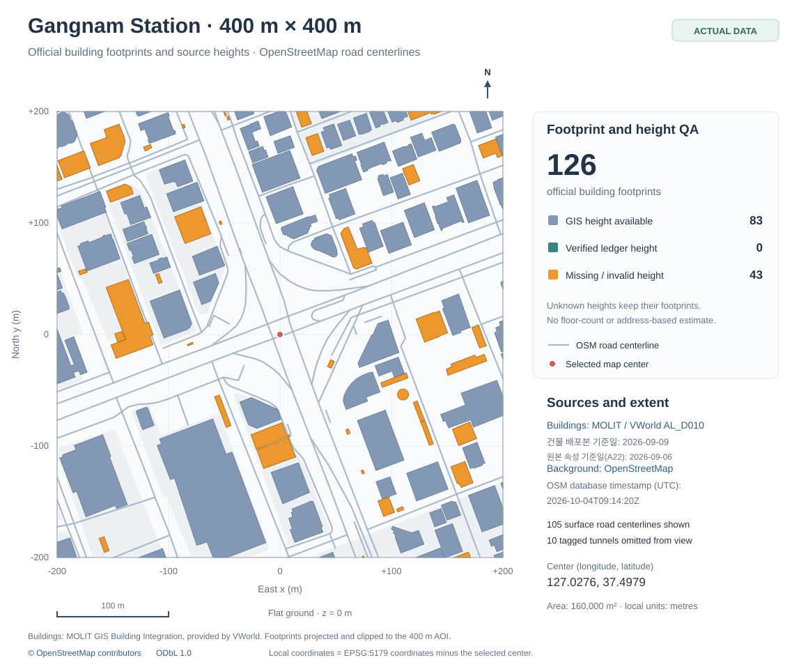
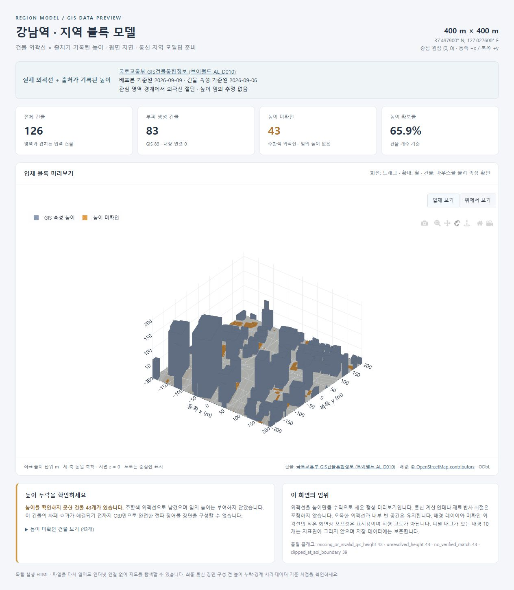

# Gangnam Urban Block Lab

[](https://github.com/ytw1227/gangnam-urban-block-lab/actions/workflows/tests.yml)

**강남역 중심 400 m × 400 m · 공식 건물 폴리곤 기반 도시 모델링**

국토교통부 GIS건물통합정보의 건물 외곽선과 높이, OSM의 실제 도로·토지이용을 같은 좌표계로 맞춰 확인하는 Python 프로젝트입니다. 건물 외곽선을 지면에서 수직으로 세우며 지면은 평면으로 둡니다. 전파 계산과 드론 제어는 포함하지 않습니다.

> **실제 자료 적용 완료:** 공식 서울 GIS 원본에서 강남역 중심 400 m 영역에 걸치는 **126개 건물**을 추출했습니다. GIS 높이가 있는 **83개는 입체화**, 원본 높이가 0인 **43개는 미확인 외곽선**으로 보존합니다. 실제 건물·OSM 배경·출처 파일을 저장소에 포함하여 설치 후 F5로 실행할 수 있습니다. 이전 합성 예제는 기본 실행에서 제외했습니다.



*공식 폴리곤을 그대로 투영·절단한 평면도입니다. 주황색은 높이 미확인 건물이며, 도로는 중심선입니다.*



## 범위와 데이터

| 항목 | 설정 및 상태 |
|---|---|
| 대상 | 강남역 사거리 부근 중심, 400 m × 400 m 정사각형 |
| 중심 | 경도 127.027600°, 위도 37.497900°; 특정 건물 중심이 아닌 고정 실험 중심점 |
| 평면 좌표 | EPSG:5179(m), 로컬 x/y = 중심 좌표에서 ±200 m |
| 지면 | 모든 위치에서 z = 0 |
| 건물 | 국토교통부 GIS건물통합정보 AL_D010: 126개, 강남구 78개·서초구 48개 |
| 배포본 / 속성 기준일 | 배포본 2026-09-09 / 추출 건물 A22 속성 기준일 2026-09-06; 개별 건물 실측일과는 구별 |
| 배경 | 실제 OSM 자료 126개: 도로·보행로 114, 토지이용 11, 수계 1 |
| OSM 시점 | 데이터베이스 기준 2026-10-04 09:14:20 UTC |
| 높이 | GIS 83개(6.9–199.28 m), 미확인 43개(null), 대장 보완 0개 |
| 경계 처리 | 경계 교차 39개를 모델 범위에서 절단; 원본 추출 파일에는 전체 외곽선 보존 |

배경의 수계 1개는 OSM에서 `tunnel=yes`, `layer=-1`로 표시된 반포천입니다. 터널 태그가 있는 도로·보행로 9개와 이 수계 1개는 지표면에 그리지 않으며 원본 태그와 도형은 데이터에 보존합니다. 화면에는 도로·보행로 **중심선 105개**를 표시하며 폭을 임의로 추정하지 않습니다. OSM 자체의 갱신 차이와 누락 가능성은 남습니다.

1 km 지도와 다른 지역은 현재 실행 대상이 아닙니다. 여의도·홍대입구·판교·분당 후보 설정은 `config/regions.pending.json`에 보관합니다. 기존 로컬 출력 폴더도 자동 삭제하지 않습니다.

## 실행

Python 3.13에서 검증합니다. Windows PowerShell 기준:

```powershell
git clone https://github.com/ytw1227/gangnam-urban-block-lab.git
cd gangnam-urban-block-lab
python -m venv .venv
.\.venv\Scripts\python.exe -m pip install -r requirements.txt
.\.venv\Scripts\python.exe run_preview.py
```

실제 400 m 건물과 배경이 저장소에 포함되어 있으므로 기본 실행에 브이월드 로그인이나 서울 전체 ZIP은 필요하지 않습니다. HTML을 생성한 뒤에는 오프라인으로 볼 수 있습니다.

### 원본에서 다시 추출할 때

1. [브이월드 GIS건물통합정보](https://www.vworld.kr/dtmk/dtmk_ntads_s002.do?svcCde=NA&dsId=18)에서 로그인한 뒤 **서울특별시 / 전체데이터** ZIP을 받습니다. 강남역 주변에는 서초구와 강남구가 함께 포함됩니다.
2. ZIP을 `data/raw/official_vworld/`에 보관합니다. 원본 ZIP은 Git에 올라가지 않습니다.
3. 새 폴더로 추출하여 저장소의 검증된 입력과 비교할 수 있습니다. 아래는 보관 중인 배포본을 다시 추출하는 예시입니다.

```powershell
.\.venv\Scripts\python.exe scripts/import_official_gangnam.py `
  data/raw/official_vworld/AL_D010_11_20260909.zip `
  --snapshot-date 2026-09-09 --encoding cp949 --out data/local/gangnam_reimport
```

이 명령은 건물 재추출용입니다. 별도 출력 폴더에 배경 파일이 없으면 전체 provenance 묶음은 만들지 않으며 F5는 기존 검증된 입력을 계속 사용합니다. 실제 DBF에는 문자 인코딩 정보가 없어 CP949를 명시했습니다.

원본 `.prj`, GDAL이 해석한 CRS, 공식 배포 시점의 좌표계를 대조합니다. 실제 원본은 EPSG:5186입니다. 축 순서·단위 이름의 표현이 다르면 지리 기준계·투영법·파라미터·단위가 모두 동등한지 검사하며 좌표계를 추측하거나 강제로 덮어쓰지 않습니다. 400 m 영역과 교차하는 건물의 **전체 원본 외곽선**을 좌표 변환해 보관하고 실제 모델을 만들 때 영역 경계에서 자릅니다.

공식 배포 컬럼 정의서에 따라 사용하는 주요 열:

| 열 | 의미 / 용도 |
|---|---|
| A1 | GIS건물통합식별번호, 문자열 건물 ID |
| A16 | 높이(m), 우선 적용할 GIS 높이 |
| A19 / A22 | 건축물ID / 데이터기준일자 보존 |
| A24 / A25 | 건물명 / 건물동명 보존; 화면 이름 표시는 하지 않음 |
| A26 / A27 | 지상 / 지하 층수 보존; 층수로 높이를 만들지 않음 |

A2(PNU)는 필지 식별자이므로 건물 ID로 사용하지 않습니다. 원본·추출 파일 SHA256, 기준일, CRS, 처리 과정, 결측·중복 행을 출처 기록에 남깁니다. 기존 준비 파일은 덮어쓰지 않습니다.

### VS Code에서 400 m 지도 열기

F5의 **강남역 400m × 400m (공식 GIS 입력)**을 선택하거나 다음을 실행합니다.

```powershell
.\.venv\Scripts\python.exe run_preview.py
```

`data/gangnam_400/`의 `buildings.gpkg`, `background.gpkg`, `schema.json`, `provenance.json`이 모두 필요합니다. 중심·영역 크기·입력 SHA256을 확인한 뒤 `outputs/gangnam_actual400_날짜시간/`에 지도 하나를 만들고 브라우저로 엽니다. 파일이 없거나 출처 기록과 다르면 오류를 표시하며 합성 건물을 만들지 않습니다.

파일만 생성하려면:

```powershell
.\.venv\Scripts\python.exe -m region_model build --size 400 `
  --buildings data/gangnam_400/buildings.gpkg `
  --schema data/gangnam_400/schema.json `
  --background data/gangnam_400/background.gpkg `
  --provenance data/gangnam_400/provenance.json `
  --out outputs/gangnam_actual_review
```

## 형상과 높이 처리

오목한 외곽선, 내부 중정, 다중 폴리곤을 유지하여 삼각형 메시를 만듭니다. 건물을 사각 상자로 바꾸거나 축척을 과장하지 않습니다. 지붕 형태·창문·외벽 재료를 재현하는 정밀 3D 모델은 아닙니다.

유효한 GIS 높이를 먼저 사용합니다. 없을 때는 **동일 건물임을 확인한 건축물대장 표제부**만 연결할 수 있습니다. 주소 유사성, 층수×임의 층고, 인근 건물 높이는 사용하지 않습니다. 미확인 건물은 주황색 평면 외곽선과 품질 기록에 남으며 입체 메시에서 제외됩니다. 따라서 OBJ만으로 누락 없는 차폐 장면이라고 판단하면 안 됩니다.

[건축HUB 건축물대장정보](https://www.data.go.kr/data/15134735/openapi.do) 등에서 보완 자료를 확보할 수 있습니다. 현재 코드는 대장 API 자동 호출이나 동일 건물 자동 판정을 하지 않습니다. `examples/ledger.csv`, `examples/verified_matches.csv`는 실제 건물이 아닌 **입력 형식 예시**입니다.

- 대장 CSV: `ledger_id,height_m,record_type,namespace`; `record_type=title`인 개별 건물 표제부만 사용합니다.
- 연결표 CSV: `building_id,ledger_id,namespace,verified,identity_method,identity_evidence`.
- `verified=true`, `identity_method=official_crosswalk` 또는 `manual_building_confirmation`, 확인 근거가 필요합니다.
- 동일 표제부를 여러 동에 복제하지 않습니다. 문자열 ID와 namespace를 유지하고 중복·일대다 관계를 거부합니다.
- `build` 명령에 `--ledger`와 `--matches`를 추가하면 보완 자료를 사용할 수 있습니다.

확인 근거의 진위는 사람이 검토해야 합니다. 해시 검증도 파일 일치 여부를 확인하며 원본 속성이 현재 현장과 일치함을 보증하지 않습니다.

## 출력과 실험 범위

| 파일 | 내용 |
|---|---|
| `preview.html` | 오프라인 입체/평면 보기, 높이 출처와 누락 표시 |
| `model.gpkg` | EPSG:5179 건물·영역·배경; 미확인 높이 외곽선도 보존 |
| `scene.local.json` | 중심 원점의 m 단위 건물 형상·높이; 지리 GeoJSON과 구별 |
| `buildings_known_heights.obj` | 높이가 있는 건물만 포함한 닫힌 삼각형 메시 |
| `quality.csv` | 원본 높이, 채택 출처, 연결·도형 보정·경계 절단·누락 |
| `manifest.json` | 중심·크기·CRS·원점 변환·출처·품질 집계 |

로컬 x는 동쪽, y는 북쪽, z는 지면 기준 높이입니다. 세 축은 미터 단위 같은 축척이며 로컬 좌표에 EPSG:5179를 붙이지 않습니다. 경계에 걸친 건물은 400 m 정사각형에서 절단하고 기록합니다. **실험 범위 밖 건물과 외부 신호 영향은 제외**합니다.

`simulation_ready=false`는 RF 계산기가 아직 없다는 뜻입니다. `mesh_complete`는 입력 건물의 높이·도형 처리 상태이며 실제 지역의 모든 건물이 수집됐다는 보증은 아닙니다. 군집 드론의 배치·간섭·차폐 실험에는 별도의 송수신 설정과 계산 방식이 필요합니다.

## 검증과 구조

```powershell
.\.venv\Scripts\python.exe -m unittest discover -s tests -v
```

좌표·경계 절단, 높이 우선순위·결측, ID 연결, 오목한 형상·중정·닫힌 메시, 공식 원본 가져오기, 출처 일치, 자료가 없을 때 F5 중단을 검사합니다. 테스트용 합성 도형은 실제 지역의 자료 검증을 대신하지 않습니다.

실제 원본 적용 후 추가로 확인한 결과:

- 원본 126개 건물의 문자열 ID·선택 속성·투영된 전체 외곽선과 저장 입력이 모두 일치합니다.
- 출력 외곽선은 원본을 400 m 정사각형에서 자른 결과와 면적 차이가 0입니다.
- 83개 GIS 높이는 원본값을 유지하고, 높이 0인 43개는 null로 남깁니다.
- OBJ 84개 폴리곤 부분의 닫힘·면 방향·중정·체적을 검사했습니다. 83개 건물 중 하나가 경계 절단 후 두 부분으로 나뉘었습니다.
- 실제 HTML의 입체/평면 전환과 누락 목록을 확인했습니다.

높이 확보율은 건물 수 기준 65.9%입니다. 높이 미확인 건물은 총 건물 바닥면적의 약 17.5%이므로, 이후 차폐 계산 전에 보완 또는 불확실성 처리가 필요합니다.

```text
region_model/                  좌표·형상·높이·배경·미리보기
scripts/import_official_gangnam.py  공식 AL_D010의 400m 범위 추출
scripts/render_overview.py      같은 실제 입력으로 README 평면도 재생성
data/gangnam_400/               공개 가능한 실제 자료와 출처
config/                        활성 지역·보관 중인 후보·스키마 예시
examples/                      대장 연결 형식 예시
tests/                         처리 규칙 검증
run_preview.py                 실제 400m 자료만 읽는 VS Code 실행 파일
```

`region_model/demo.py`와 `docs/assets/scene-comparison.svg`는 이전 **합성 소프트웨어 검증 자료**입니다. 실제 강남역 모델에 사용하지 않습니다. 별도의 `demo` 명령을 명시적으로 실행할 때에만 사용되며 F5 경로에는 연결하지 않습니다.

## 데이터 출처와 이용 조건

- 건물: [국토교통부 GIS건물통합정보](https://www.data.go.kr/data/15083092/fileData.do), [브이월드 배포](https://www.vworld.kr/dtmk/dtmk_ntads_s002.do?svcCde=NA&dsId=18). 브이월드 표시 조건은 [CC BY](https://creativecommons.org/licenses/by/2.0/kr/), 공공데이터포털에는 공공누리 제1유형(출처표시)이 안내되어 있습니다. 출처·기준일·변환 내역은 `buildings.provenance.json`, 이용 조건은 `data/gangnam_400/LICENSE-BUILDINGS.md`에 보존합니다.
- 배경: © OpenStreetMap contributors, [ODbL 및 출처 안내](https://www.openstreetmap.org/copyright). 상세 출처와 해시는 `data/gangnam_400/background.provenance.json`, 이용 조건은 `data/gangnam_400/LICENSE-OSM.md`에 있습니다.
- 수집 도구: [OSMnx 공식 문서](https://osmnx.readthedocs.io/en/stable/user-reference.html).

원본 ZIP·개인 설정·인증정보·생성 결과·가상환경은 Git 추적에서 제외합니다. 데이터 이용 조건과 프로그램 코드의 이용 조건은 구별됩니다.
